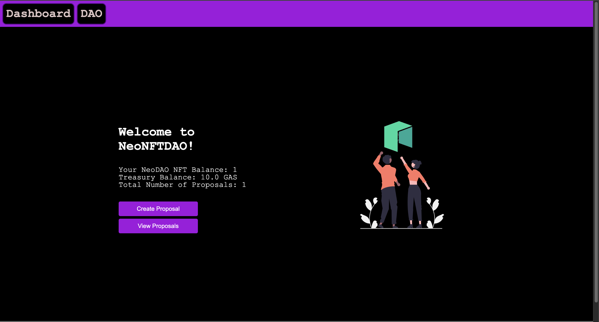

<h1 aling="center">NeoNFT DAO 🎨</h1>

  <br>
  <br>



Making the frontend part of my project DAO smart contract!

<hr>
<h2> Installing / Getting started </h2>

```bash
# Clone this project
$ git clone https://github.com/gab0071/DAO-FRONT

# Access
$ cd DAO-FRONT

# Install dependencies
$ npm install

```

<h2>Commands</h2>

- $ ` npx create-next-app@latest`
- $ `npm run dev `
  <strong>Now go to `http://localhost:3000`, your app should be running </strong>🤘

Open up a terminal pointing at `my-app directory` and execute this command:

- $ ` npm install web3modal ethers`

Note🚨 ➡ to interact with your smart contract in the folder `constants/index.js` write:

```javascript
export const CRYPTODEVS_DAO_CONTRACT_ADDRESS = "";
export const CRYPTODEVS_NFT_CONTRACT_ADDRESS = "";
export const CRYPTODEVS_DAO_ABI = [];
export const CRYPTODEVS_NFT_ABI = [];
```

<h2> Technologies / Built With </h2>

- Next.js
- Ethers.js
- Web3Modal
<hr>
Hope you enjoy making this.
<br>
<br>

<p align="center">
<br/>
  Made with ❤️ by <b>Md Mohsin Siddiqui</b>.
</p>
# nep-hack-dao-frontend
